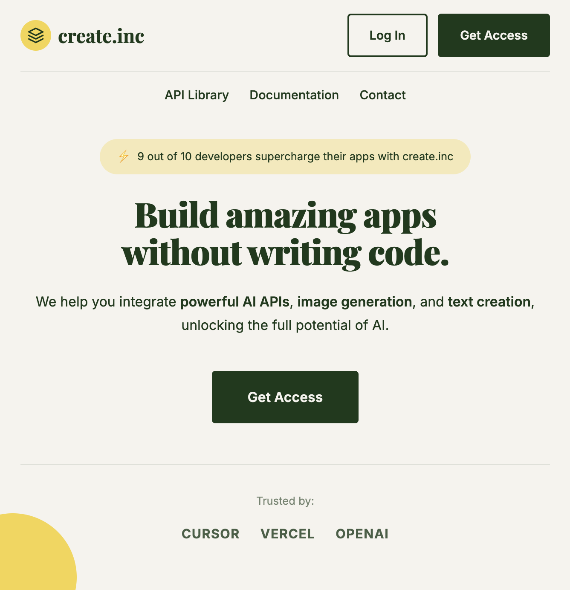
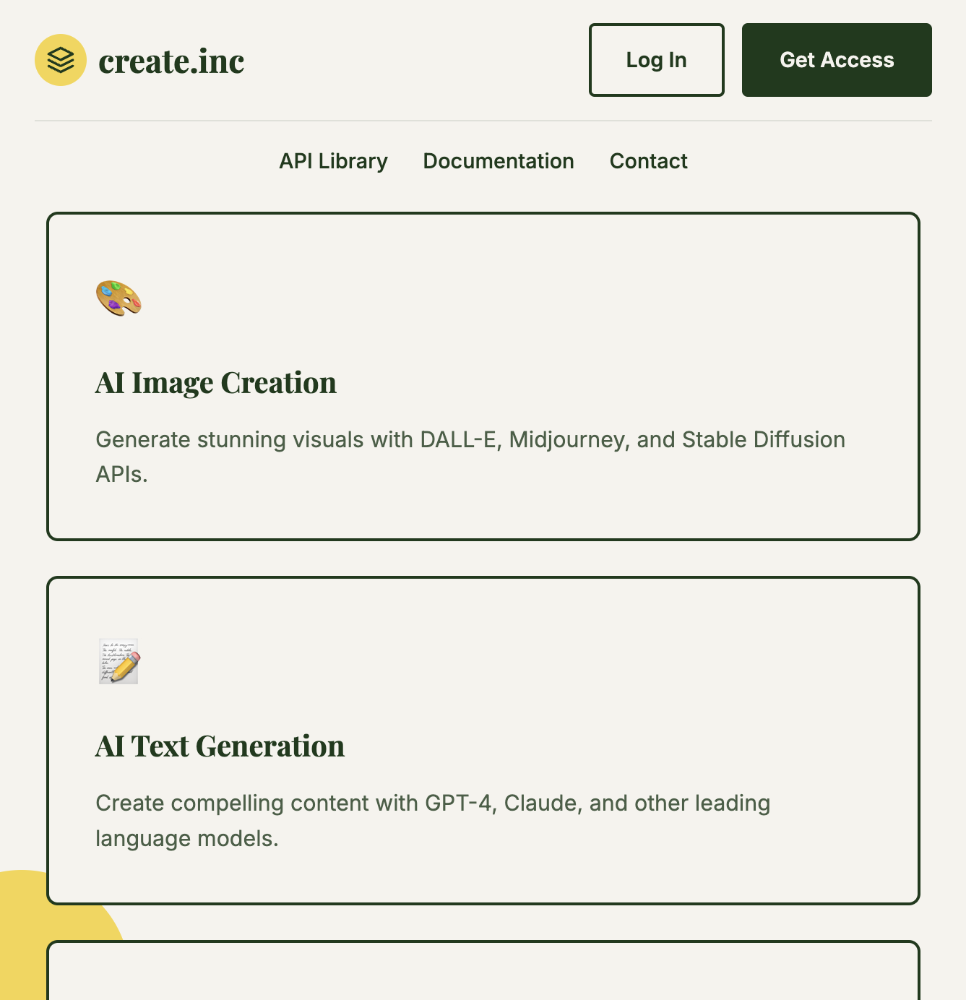

# create.inc

A modern landing page for **create.inc** - your gateway to powerful AI APIs within Cursor.

**Developed by Dewoo Sawant**

---

## Screenshots

### Hero Section


### Features Section


### Footer Section


---

## Overview

create.inc is a platform where developers can discover and integrate amazing AI APIs into their applications without writing complex code. We provide access to:

- **AI Image Creation** - Generate stunning visuals with DALL-E, Midjourney, and Stable Diffusion
- **AI Text Generation** - Create compelling content with GPT-4, Claude, and other LLMs
- **AI Video** - Generate and edit videos using cutting-edge AI synthesis tools
- **AI Avatars** - Create realistic AI avatars and virtual characters
- **RAG Tools** - Build intelligent retrieval-augmented generation systems
- **Train Your Model** - Fine-tune and train custom AI models

## Design

This landing page is styled to match the SayBriefly design aesthetic:

| Property | Value |
|----------|-------|
| Background | Cream/beige (#F5F3ED) |
| Primary Text | Dark green (#1A3A1A) |
| Accent | Yellow (#F5D547) |
| Heading Font | Playfair Display (serif) |
| Body Font | Inter (sans-serif) |

## Features

- Responsive navigation with logo and CTA buttons
- Social proof badge with statistics
- Bold hero headline with serif typography
- Feature cards showcasing AI capabilities
- Preview card showing API example
- Dark green footer with links
- Yellow decorative circle accent
- Fully responsive design

## Getting Started

Simply open `index.html` in your browser or serve it with any static file server:

```bash
# Using Python
python3 -m http.server 8080

# Using Node.js
npx serve
```

Then visit `http://localhost:8080`

## Tech Stack

- HTML5
- CSS3 (Custom Properties, Flexbox, Grid)
- Google Fonts (Playfair Display, Inter)

## Author

**Dewoo Sawant**

- GitHub: [@dewoosawant123](https://github.com/dewoosawant123)

## License

MIT

---

Made with Cursor AI
